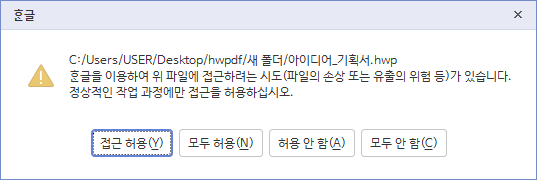

<div align="center">

# 🔄 HWPDF

**HWP/HWPX를 PDF로 간단하게 변환하세요**

[](https://github.com/gaon12/hwpdf/releases)
[](https://github.com/gaon12/hwpdf/releases)
[](LICENSE)
[](https://python.org)

</div>

---

## 🚀 빠른 시작

### 📦 실행 파일 다운로드 (권장)

한글이 설치된 Windows PC라면 바로 사용 가능합니다.

**[📥 최신 버전 다운로드](https://github.com/gaon12/hwpdf/releases/latest)**

1. `hwpdf.exe` 다운로드
2. 실행 후 HWP 파일 드래그 앤 드롭
3. 변환 완료! 🎉

### 🐍 Python으로 실행

```bash
# 설치
pip install pywin32 PyQt6

# 실행
python hwpdf.py
```

---

## ✨ 특징

<table>
<tr>
<td width="50%">

### 🎯 **간단함**
- 드래그 앤 드롭만으로 변환
- 원클릭 일괄 변환
- 직관적인 GUI

</td>
<td width="50%">

### ⚡ **빠름**
- 멀티스레딩 지원
- 실시간 진행률 표시
- 언제든 중단 가능

</td>
</tr>
<tr>
<td width="50%">

### 🛠️ **유연함**
- GUI와 CLI 모드 지원
- 배치 스크립트 작성 가능
- 덮어쓰기 옵션

</td>
<td width="50%">

### 🔒 **안전함**
- 원본 파일 보존
- 변환 실패 시 로그 제공
- 중복 파일 확인

</td>
</tr>
</table>

---

## 📱 사용법

### GUI 모드

<div align="center">

```
hwpdf.exe 실행 → 파일 드래그 → 변환 시작 → 완료!
```

</div>

### CLI 모드

```bash
# 폴더 전체 변환
hwpdf.exe -d "C:\내문서\한글파일들"

# 특정 파일만
hwpdf.exe -f "보고서.hwp" "제안서.hwpx"

# 덮어쓰기 허용
hwpdf.exe -d "C:\문서" --overwrite
```

---

## 📋 시스템 요구사항

| 항목 | 요구사항 |
|------|----------|
| **OS** | Windows 7/10/11 |
| **한글** | 한컴오피스 한글 (필수) |
| **Python** | 3.7+ (소스 실행시) |

---

## 🛠️ 개발자용

<details>
<summary><b>소스코드로 실행하기</b></summary>

### 설치
```bash
git clone https://github.com/gaon12/hwpdf.git
cd hwpdf
pip install -r requirements.txt
```

### 실행
```bash
python hwpdf.py
```

### 빌드
```bash
pip install nuitka
nuitka run.py --onefile --standalone --enable-plugin=pyqt6 --windows-icon-from-ico=icon.ico --output-dir=build --mingw64 --windows-disable-console --include-data-files=icon.png=icon.png
```

</details>

---

## 💡 자주 묻는 질문

<details>
<summary><b>백신 프로그램이 바이러스래요. 님 해커에요?</b></summary>

그럴리가요. 명백한 오진입니다. 오진의 이유는 다양하지만, exe로 변환 시 사용되는 라이브러리 pyinstaller나 nuitka로 빌드하면 오진이 빈번하게 나오더라고요. 예외처리 후 사용하시거나, 정 못 믿으시겠다면 파이썬 코드를 직접 실행해 보세요.

</details>

<details>
<summary><b>PDF 파일은 어디에 저장되나요?</b></summary>

HWP/HWPX 파일과 동일한 폴더에 저장됩니다.

</details>

<details>
<summary><b>한글이 설치되어 있는데 "한글 프로그램을 찾을 수 없습니다" 오류가 나요</b></summary>

1. 한글을 한 번 실행해서 초기 설정을 완료하세요
2. 관리자 권한으로 실행해보세요
3. 한글 버전과 Python 비트(32bit/64bit)를 맞춰주세요

</details>

<details>
<summary><b>변환하는데 경고 메시지가 떠요</b></summary>



한글 프로그램을 외부 프로그램/코드로 작동시키는 경우, 보안을 위해 사용자에게 경고 메시지를 띄웁니다. '접근 허용' 또는 '모두 허용'을 눌러야 작동합니다.

</details>

<details>
<summary><b>CLI 환경에서 프로그램 실행은 완료되었는데, PDF 파일이 생성되지 않았어요</b></summary>

CLI 환경에서 프로그램 실행이 완료되고 다음 명령어를 입력할 수 있는 상태가 됨에도 불구하고, 한컴오피스에서 실행 및 변환하는데 시간이 걸릴 수 있어요. 조금만 기다리시면 pdf 파일이 생성될 거에요.

</details>

<details>
<summary><b>변환된 PDF 품질이 좋지 않아요</b></summary>

이 도구는 한글 프로그램의 PDF 내보내기 기능을 사용합니다. 한글에서 직접 PDF로 내보낸 것과 동일한 품질입니다.

</details>

<details>
<summary><b>여러 폴더의 파일을 한번에 변환하고 싶어요</b></summary>

CLI 모드에서 절대 경로로 파일들을 지정하면 됩니다:
```bash
hwpdf.exe -f "C:\폴더1\파일1.hwp" "D:\폴더2\파일2.hwp"
```

</details>

---

## 🤝 기여하기

🐛 **버그 발견** → [Issues](https://github.com/gaon12/hwpdf/issues)에 등록 
🔀 **코드 기여** → Pull Request 환영합니다!

---

## 📄 라이선스

[GPL-3.0](./LICENSE)

---

<div align="center">

**도움이 되셨나요? ⭐ Star를 눌러주세요!**

※ 한컴오피스, 한글 등은 한컴의 등록상표이며, 본 문서 또는 서비스는 한컴과 무관합니다.

</div>
